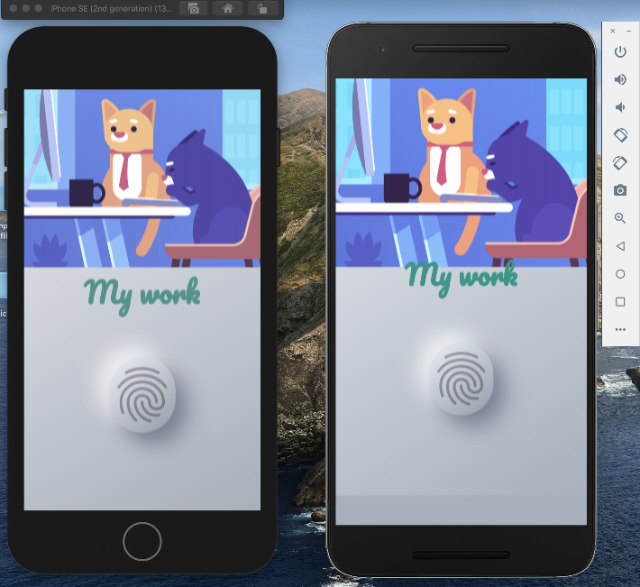

# flutter_web_example

A new Flutter project.

## My  Goal

The objective of this flutter application about asynchronous programming in Dart II.It shows how to carry out time consuming tasks such as getting device location and networking to get data from the internet. 

## What packages I've used to build it?

## cupertino_icons
## flutter_launcher_icons

## flutter_localized_locales

## flutter_neumorphic

## flutter_bloc

## equatable

## animated_text_kit
## shared_preferences
## auto_size_text

## What I've learned ?

- How to use flutter bloc to localizations.
- Using layer architecture, in this casse I used Presentation -> Bussiness Logic -> Data.
- Deeping in architecture layer, like repositories.
- How the widget Material App works with the Localizations, it listen of state of bloc.
- How widget Language Card it allow to user change easily the language of the App.
- How future method works.
- How to pass data forwards and backwards between screens using the Navigator.
- How to handle exceptions in Dart using try/catch/throw.
- How implement the package flutter_neumorphic, and show the fingerprint

>Feel free visit my webpage to see more details (https://www.marialijideveloper.com/?page_id=148/)

